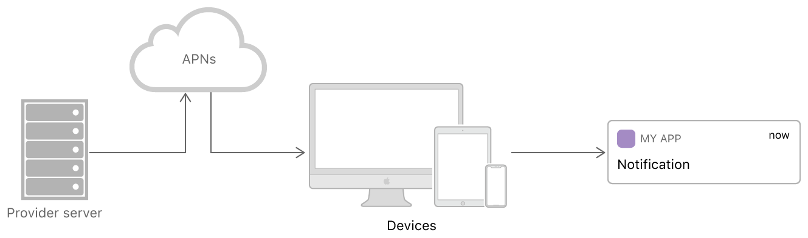

# Notication
iOS Notification

参考文章：
[iOS 推送通知及推送扩展](https://juejin.im/post/5bc9a6e45188254a075e305c)

[iOS推送之远程推送](https://www.jianshu.com/p/4b947569a548)

[玩转 iOS 10 推送 —— UserNotifications Framework（上）](https://www.jianshu.com/p/2f3202b5e758)

[玩转 iOS 10 推送 —— UserNotifications Framework（中）](https://www.jianshu.com/p/5a4b88874f3a)

[玩转 iOS 10 推送 —— UserNotifications Framework（下）](https://www.jianshu.com/p/25ca24215f75)

[iOS 10 消息推送（UserNotifications）秘籍总结（二）](https://www.jianshu.com/p/81c6bd16c7ac)

[APNs Auth Key Token 验证模式](https://www.jianshu.com/p/b700f0237b0e)
这种推送方式也需要开启对应推送权限，在开发者账号的appid中证书会显示警告，可以忽略。

[WWDC 2018：iOS 12 通知的新特性](https://juejin.im/post/5b1b7c3de51d4506ca62d787)

[iOS App Extension入门](https://www.jianshu.com/p/8cf08db29356)

[iOS10推送通知整理总结](https://www.jianshu.com/p/f465fde82c4b)

[iOS Push的前世今生](https://juejin.im/entry/5a9118d2f265da4e6f17fcfc)

[iOS图片推送的一些开发小Tips](https://www.jianshu.com/p/0ab721604877)

[ios 推送通知（四）](https://www.zybuluo.com/evolxb/note/482251)


## 远程推送原理，推送证书配置的两种方式
### 原理
iOS app大多数都是基于client/server模式开发的，client就是安装在我们设备上的app，server就是对应远程服务器，主要给app提供数据，也被成为Provider。那么当app处于terminate状态时，当client与server断开时，就需要通过APNs（Apple Push Notification service）进行通信。

推送消息传输路径： Provider-APNs-Client App

我们的设备联网时（无论是蜂窝联网还是Wi-Fi联网）都会与苹果的APNs服务器建立一个长连接（persistent IP connection），当Provider推送一条通知的时候，这条通知并不是直接推送给了我们的设备，而是先推送到苹果的APNs服务器上面，而苹果的APNs服务器再通过与设备建立的长连接进而把通知推送到我们的设备上（如下图）。而当设备处于非联网状态的时候，APNs服务器会保留Provider所推送的最后一条通知，当设备转换为连网状态时，APNs则把其保留的最后一条通知推送给我们的设备；如果设备长时间处于非联网状态下，那么APNs服务器为其保存的最后一条通知也会丢失。Remote Notification必须要求设备连网状态下才能收到，并且太频繁的接收远程推送通知对设备的电池寿命是有一定的影响的。


### deviceToken
当一个App注册接收远程通知时，系统会发送请求到APNs服务器，APNs服务器收到此请求会根据请求所带的key值生成一个独一无二的value值也就是所谓的deviceToken，而后APNs服务器会把此deviceToken包装成一个NSData对象发送到对应请求的App上。然后App把此deviceToken发送给我们自己的服务器，就是所谓的Provider。Provider收到deviceToken以后进行储存等相关处理，以后Provider给我们的设备推送通知的时候，必须包含此deviceToken。(参考下图理解)


* deviceToken是什么：deviceToken其实就是根据注册远程通知的时候向APNs服务器发送的Token key，Token key中包含了设备的UDID和App的Bundle Identifier，然后苹果APNs服务器根据此Token key编码生成一个deviceToken。deviceToken可以简单理解为就是包含了设备信息和应用信息的一串编码。

* deviceToken作用：上面提到Provider推送消息的时候必须带有此deviceToken，然后此消息就根据deviceToken（UDID + App's Bundle Identifier）找到对应的设备以及该设备上对应的应用，从而把此推送消息推送给此应用。

* deviceToken唯一性：苹果APNs的编码技术和deviceToken的独特作用保证了他的唯一性。唯一性并不是说一台设备上的一个应用程序永远只有一个不变的deviceToken，当用户升级系统、app重新安装的时候deviceToken是会变化的。

### JSON payload （远程推送数据结构解读）
远程推送主要通过JSON payload进行传递信息，payload中包含了不同推送类型，用户交互（alert、sound、badge）以及app自定义信息。（此处参考[官方文档](https://developer.apple.com/documentation/usernotifications/setting_up_a_remote_notification_server/generating_a_remote_notification)）


一个基础的远程推送payload包含Apple-defined keys和自定义keys，你可以添加不同的keys在payload中；但是APNs也针对如下情况进行推送限制：
   
1. Voice over Internet Protocol (VoIP)推送最大payload不能超过5k(5120 bytes)
2. 其他所有的远程推送，payload大小不能超过4k(4096 bytes)

payload就是一个json数据结构，payload数据结构中除了苹果定义的keys，开发者可以自定义keys，自定义的keys在UNNotificationContent中userInfo属性中。
sound字段中的音频文件必须是在设备中已存在的或者app的bundle中存在的。
避免在推送payload中放入一些敏感字段，防止信息泄露；如果迫不得已，需要对该信息进行加密。

payload数据结构示例（可通过推送测试工具[NWPusher](https://github.com/noodlewerk/NWPusher.git)，参考Demo进行推送测试）
```json
{
    "aps": {
        "alert": {
            "body": "好几天都不开看我啦？送一个@张小伙jsme的视频给你，看看我嘛！",
            "loc-key": "LOC_KEY",
            "loc-args": ["替换参数一","替换参数二"]
        },
        "sound": "default",
        "badge": 1,
        "mutable-content": 1,
	   "category": "UNInviteCategoryIdentifier"
    },
    "msgid": "123",
    "media": {
        "type": "image",
        "url": "https://www.fotor.com/images2/features/photo_effects/e_bw.jpg"
    }
}
```
数据结构详细说明
```js
{
    "aps": {
        "alert": {//alert字段也支持字符串，因为在iOS10之前是仅有一个标题没有这么多扩展，例如："alert": "标题"
            "title": "标题",
            "subtitle": "副标题",
            "body": "主题内容",
            "loc-key": "主要用于本地化，本地化字符串标示；在本地化标示对应的value中可用使用%@,%n$@来从title-loc-args中添加格式化字符串",
            "loc-args": "loc-key对应值中的格式化字符串",
            "launch-image": ""
        },
        "sound": {//sound字段也支持字符串，例如：'sound': 'default'。针对扩展字段的支持iOS12系统才有效
            "critical": 1,//⚠️标示，设置为1有效，在iOS12下尝试，并没有效果体现
            "name": "default",//声音名称，若为自定义声音，要保证app bundle存在该声音资源；特殊值‘default’是指用系统默认声音提示
            "volume": 0.5//音量大小，范围0~1，在iOS12下尝试，并没有效果体现
        },
        "badge": 1,//通知icon的角标数量
        "content-available": 1,//若设置为1时有效，表示有新的内容。通常用于静默通知，通过alert、sound、badge字段为空。若app进程不存在情况下会唤醒app调用[UIApplicationDelegate application:didReceiveRemoteNotification:fetchCompletionHandler:]代理，有30s的时间处理通知。
        "mutable-content": 1,//设置为1，表示该通知会先会调起Notification Service Extension处理完后再进行通知
	    "category": "UNInviteCategoryIdentifier",//只要是指Notification Content Extension中使用哪个category进行展示
        "thread-id": "threadIdentifier",//线程标识符，主要应用于iOS12及以后系统，进行通知分组
        "launch-image": ""//用户通过通知进入应用时，使用这个文件（启动图文件或者storyboard文件）的启动图片。如果没有指定这个属性，系统会使用上次的应用快照或者Info.plist中UILaunchImageFile的图片或Default.png作为启动图片。该字段不适用于iOS，仅用于macos和tvos
    },
    
    //除aps字段中为官方定义keys外，以下字段都可以自定义

    "msgid": "123",
    "media": {
        "type": "image",
        "url": "https://www.fotor.com/images2/features/photo_effects/e_bw.jpg"
    }
}

```

### 证书配置 - [Certificate-Based Connection](https://developer.apple.com/documentation/usernotifications/setting_up_a_remote_notification_server/establishing_a_certificate-based_connection_to_apns)

这种证书配置比较常见，通过应用App ID创建推送SSL证书，下载证书导出对应的P12文件进行推送。


证书通过应用程序的Bundle Identifier进行绑定。还必须将证书绑定到证书签名请求(CSR)，这是用于加密证书的私钥。证书本身会成为你与APNs交换的公钥。
如果你的证书或私钥被盗用，你可以在开发者账户撤销该证书。

与APN建议信任关系图：


### 证书配置 - [Token-Based Connection](https://developer.apple.com/documentation/usernotifications/setting_up_a_remote_notification_server/establishing_a_token-based_connection_to_apns)

基于令牌的身份验证，比证书通信更快，因为它不需要APN查找与提供服务器相关的证书或其他信息。基于令牌的身份验证还有如下有点：

1. 没有时效性
2.  一个令牌可以用于多个App服务，不用为每个App单独配置（开发环境和生产环境）证书。
3.  一个令牌可以用于该开发者账号下的所有App
   
从开发者账号中申请Token：


申请密钥时生成的文本文件(具有.p8文件扩展名，只能下载一次)以及创建Token时输入的密钥ID字符串，都要妥善保管。如果你怀疑你的Token被盗用，可以撤销并生成新的密钥；为了最大限度提高安全性，可以关闭所有此时与APN的HTTP/2链接，并在发出请求之前建议新的链接。

基于Token推送认证方式，第三方推送都已支持；若想自己建立APNs通信可参考[官方文档](https://developer.apple.com/documentation/usernotifications/setting_up_a_remote_notification_server/establishing_a_token-based_connection_to_apns)


## 远程推送注册、接收远程推送，代码解读（iOS8以上）
### 推送注册
```objc
/**
 注册远程推送通知，同本地通知注册，不同的是远程推送通知授权成功时候需要调用：[[UIApplication sharedApplication] registerForRemoteNotifications];

 权限申请：
 iOS10以后，权限申请通过requestAuthorizationWithOptions进行
 iOS8---iOS10以下，权限申请回调通过UIApplicationDelegate的- (void)application:(UIApplication *)application didRegisterUserNotificationSettings:(UIUserNotificationSettings *)notificationSettings代理方法进行告知应用
 
 UNAuthorizationOptions授权类型：
 UNAuthorizationOptionBadge：更新应用角标的权限
 UNAuthorizationOptionSound：通知到达时的提示音权限
 UNAuthorizationOptionAlert：通知到达时弹窗权限
 UNAuthorizationOptionCarPlay：车载设备通知权限
 UNAuthorizationOptionCriticalAlert：iOS12引入；发送重要通知的权限，重要通知会无视静音和勿打扰模式，通知到达时会有提示音，此权限要通过苹果审核
 UNAuthorizationOptionProvisional：临时授权----无需用户授权也能给用户推送的新机制，默认为隐式推送（仅在通知中心显示通知，会包含两个按钮：保持、关闭。）
 UNAuthorizationOptionProvidesAppNotificationSettings：iOS12 通知管理->关闭 / 通知设置 页面会出现：在“Notication”中配置...选项，点击进入应用。主要是进入应用自身的通知设置页面
 */
- (void)registerRemoteNotifications {
    if (@available(iOS 10.0, *)) {
        UNUserNotificationCenter *center = [UNUserNotificationCenter currentNotificationCenter];
        center.delegate = self;
        UNAuthorizationOptions authOptions = UNAuthorizationOptionBadge | UNAuthorizationOptionSound | UNAuthorizationOptionAlert;
        if (@available(iOS 12.0, *)) {
            authOptions = UNAuthorizationOptionBadge | UNAuthorizationOptionSound | UNAuthorizationOptionAlert | UNAuthorizationOptionProvisional;
        }
        [center requestAuthorizationWithOptions:authOptions completionHandler:^(BOOL granted, NSError *_Nullable error) {
            //请求推送授权成功，下面注册远程推送。如果需要注册远程推送的话，无论用户是否授权都建议注册；否则一旦用户在设置页面开启推送，必须重新app才能注册成功。
            dispatch_async(dispatch_get_main_queue(), ^{
                [[UIApplication sharedApplication] registerForRemoteNotifications];
            });
        }];
    } else {
        /**
         iOS8 --- iOS10之前注册远程通知方法
         如果iOS10及以上系统还用该方法进行注册通知也是可以，但是APNs注册就比较乱了，会忽略用户授权直接注册成功APNs返回DeviceToken，当用户授权成功了还会重复的回调application:didRegisterForRemoteNotificationsWithDeviceToken方法。不建议这样使用。
         */
        UIUserNotificationType types = (UIUserNotificationTypeAlert | UIUserNotificationTypeSound | UIUserNotificationTypeBadge);
        //iOS8和iOS9通过这种方式设置categorys，categorys生成&使用方式与iOS10类似
        UIUserNotificationSettings *settings = [UIUserNotificationSettings settingsForTypes:types categories:nil];
        [[UIApplication sharedApplication] registerUserNotificationSettings:settings];
        //注册远程推送
        [[UIApplication sharedApplication] registerForRemoteNotifications];
    }
}

```
发起注册后需关注的代理方法：

1. deviceToken获取
```objc
    /**
 注册APNs成功，并返回deviceToken
 只要应用启动注册通知成功，每次都会调用该方法
 */
- (void)application:(UIApplication *)application didRegisterForRemoteNotificationsWithDeviceToken:(NSData *)deviceToken {
    // 获取并处理deviceToken
    NSString *token = [[deviceToken description] stringByTrimmingCharactersInSet:[NSCharacterSet characterSetWithCharactersInString:@"<>"]];
    token = [token stringByReplacingOccurrencesOfString:@" " withString:@""];
    NSLog(@"DeviceToken:%@\n", token);
}

/**
 注册APNs失败
 只要应用启动注册通知失败，每次都会调用该方法
 */
- (void)application:(UIApplication *)application didFailToRegisterForRemoteNotificationsWithError:(NSError *)error {

}

 ```
2. 使用iOS8--iOS10以下注册方法注册，回调该代理进行处理
```objc
/**
 进入应用后如果没有注册通知，需要首先注册通知请求用户允许通知；一旦调用完注册方法，无论用户是否选择允许通知此刻都会调用该代理方法。
 只要应用启动注册通知，每次都会调用该方法
 */
- (void)application:(UIApplication *)application didRegisterUserNotificationSettings:(UIUserNotificationSettings *)notificationSettings NS_DEPRECATED_IOS(8_0, 10_0, "Use UserNotifications Framework's -[UNUserNotificationCenter requestAuthorizationWithOptions:completionHandler:]") __TVOS_PROHIBITED;{

}
```

### 接收远程推送


### 如何进行后台静默推送，干一些事情


## 推送扩展的作用
推送扩展主要分为：

1. Notification Service Extension
2. 

 本地推送和远程推送同时都可支持附带Media Attachments(媒体附件)。不过远程通知需要实现通知服务扩展UNNotificationServiceExtension，在service extension里面去下载attachment，但是需要注意，service extension会限制下载的时间（30s），并且下载的文件大小也会同样被限制
 关于Media Attachments限制可参考[官方文档](https://developer.apple.com/documentation/usernotifications/unnotificationattachment?preferredLanguage=occ)

## 本地推送
